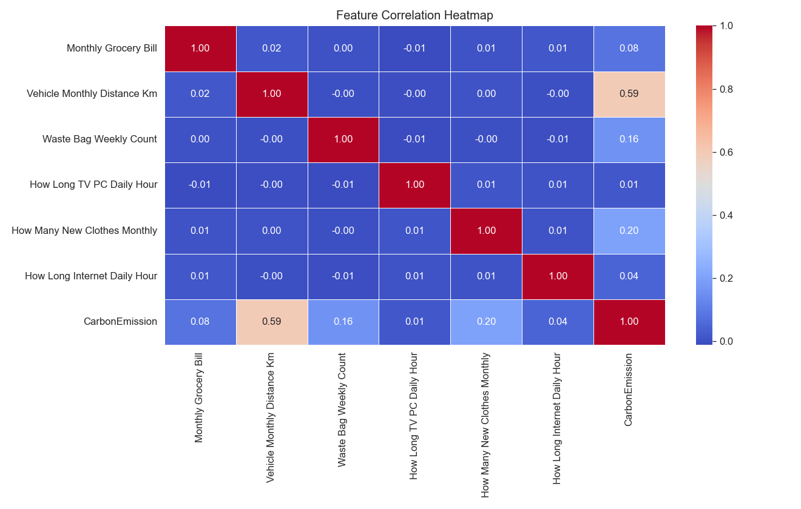
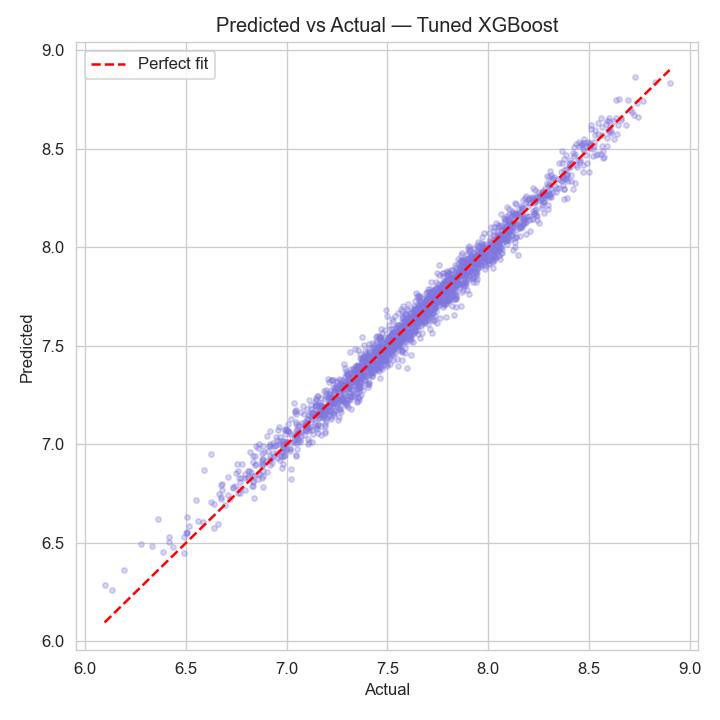
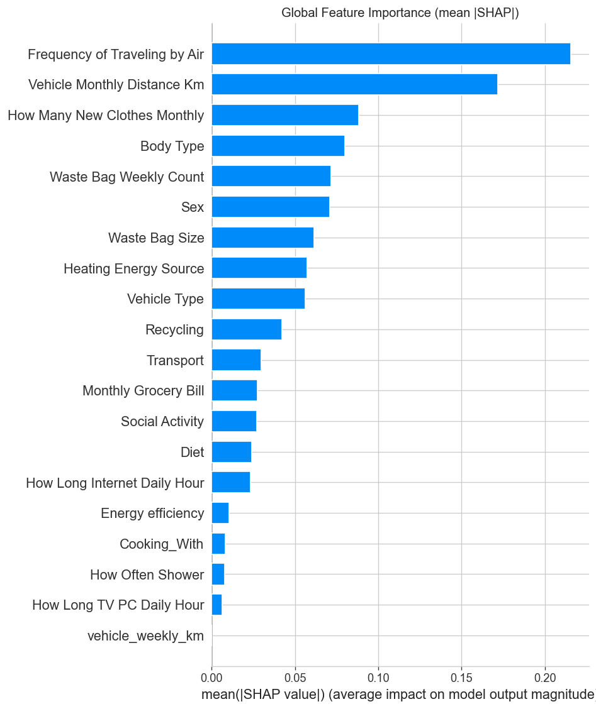
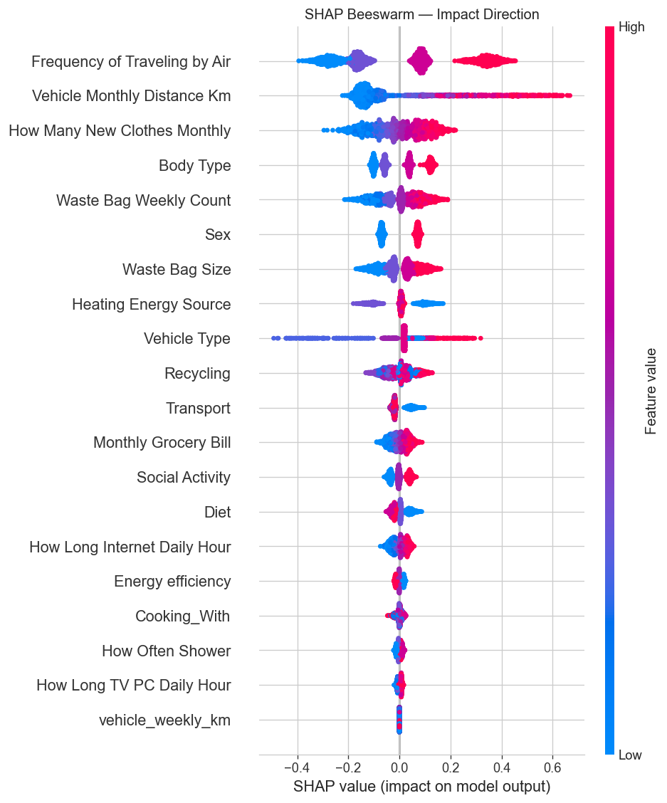

# 🌿 DeCarboniZer

An end-to-end machine learning project that predicts an individual's carbon footprint from their lifestyle habits, and explains *why* through SHAP — deployed as an interactive Streamlit app.

## Overview

Most carbon calculators just give you a number. This project goes further: it predicts your footprint, shows which of your habits drive it up the most (via SHAP explainability), compares you to peers, and lets you simulate lifestyle changes to see their impact before you make them.

**Live demo:** *(add your Streamlit Cloud link here once deployed)*

## Features

- **Footprint prediction** — estimates annual carbon emissions from 20+ lifestyle inputs (diet, transport, travel frequency, energy use, waste habits, etc.)
- **Explainability** — SHAP-based breakdown of which specific habits are pushing your footprint up or down
- **Peer comparison** — shows your footprint as a percentile against the training population
- **What-if simulator** — adjust inputs (e.g. switch to public transport, fly less) and see the predicted change in real time
- **Downloadable report** — export your results as a personal summary

## Model performance

| Model                | RMSE  | MAE   | R²    | CV-R² |
|----------------------|-------|-------|-------|-------|
| Linear Regression     | 0.191 | 0.140 | 0.805 | 0.784 |
| Decision Tree          | 0.190 | 0.149 | 0.808 | 0.806 |
| Random Forest          | 0.131 | 0.102 | 0.909 | 0.903 |
| Gradient Boosting      | 0.099 | 0.072 | 0.948 | 0.937 |
| XGBoost (baseline)     | 0.076 | 0.059 | 0.969 | 0.965 |
| **Tuned XGBoost (final)** | **0.058** | **0.044** | **0.982** | **0.980** (10-fold) |

- Trained on **10,000 records** across 21 lifestyle features
- Hyperparameters tuned via grid search + 5-fold cross-validation
- Final feature set refined by dropping low-signal features post-SHAP analysis

### Correlation overview


### Model fit


### What drives the prediction



Top drivers: **frequency of air travel**, **monthly vehicle distance**, and **new clothes purchased monthly** — consistent with known carbon-intensive lifestyle factors.

## Tech stack

- **Modeling:** Python, Pandas, NumPy, Scikit-learn, XGBoost
- **Explainability:** SHAP
- **App/UI:** Streamlit, Plotly
- **Notebook:** Jupyter (`train_model.ipynb`)

## Project structure

```
DeCarbiniZer/
├── app.py                     # Streamlit application
├── train_model.ipynb          # Full training pipeline: EDA → preprocessing → model comparison → tuning → SHAP
├── model.pkl                  # Trained XGBoost model
├── scaler.pkl                 # Feature scaler
├── explainer.pkl              # SHAP TreeExplainer
├── feature_names.pkl          # Ordered feature list expected by the model
├── label_encoders.pkl         # Categorical encoders
├── ordinal_maps.pkl           # Ordinal feature mappings
├── dropped_features.pkl       # Features removed after feature selection
├── log_transformed.pkl        # Flag for log-transformed target
├── all_train_preds.pkl        # Cached training predictions (used for peer percentile comparison)
├── data/
│   └── Carbon_Emission.csv    # Training dataset
├── assets/                    # Plots used in this README
├── requirements.txt
└── README.md
```

## Future improvements

- Deploy publicly on Streamlit Community Cloud
- Add unit tests for the preprocessing pipeline
- Expand the dataset with region-specific emission factors (currently generalized)

## Author

**Mayank Kumar Sinha**
B.Sc. Data Science, Bhawanipur Global Campus (formerly NSHM Knowledge Campus), Kolkata
[LinkedIn](https://linkedin.com/in/mayank-sinha07)